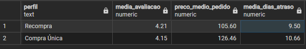

# Análise de Comportamento de Recompra | Olist

## Contexto
Este projeto analisa os principais fatores relacionados ao comportamento de recompra dos clientes do e-commerce brasileiro Olist, sendo uma extensão do [projeto de ETL](https://github.com/yagosilvax/Projeto_Pipeline_ETL) do mesmo dataset.

## Pergunta de Negócio
> Quais clientes merecem campanha de retenção e quais não valem o esforço?

A partir dessa pergunta, identifiquei que a grande maioria dos clientes compra apenas uma vez — o que mudou o foco da análise para:

> Quais fatores estão relacionados ao comportamento de recompra?

## Metodologia
Foram criadas views em SQL para separar os dois grupos e reutilizar a lógica nas consultas seguintes. O código completo está disponível na pasta `/queries`.

As três métricas comparadas entre os grupos foram:
- **Avaliação média dos produtos**
- **Valor médio gasto por produto (agrupado por categoria)**
- **Média de dias de atraso na entrega**

## Resultados
Clientes que recompraram avaliaram os produtos em média 0,06 pontos a mais (1,5% superior na escala de 1 a 5) e gastaram 19,75% menos por produto (diferença de R$20,86). Esse padrão de preço se mantém mesmo dentro das mesmas categorias de produto, o que reduz a chance de ser apenas um efeito do tipo de produto comprado. A diferença no atraso médio de entrega foi de aproximadamente 1 dia entre os grupos, insuficiente para confirmar ou descartar esse fator como relevante.

    

## Limitações
Os resultados indicam associação entre as variáveis analisadas e o comportamento de recompra — não causalidade. Para afirmar que preço ou avaliação causam recompra, seria necessário um experimento controlado.

## Recomendação
Os dados sugerem que avaliação e preço estão associados ao comportamento de recompra. Para confirmar causalidade, recomenda-se um teste A/B testando, de forma isolada, se redução de preço ou melhoria no prazo de entrega impactam a taxa de recompra.

## Tecnologias
- PostgreSQL
- PgAdmin
